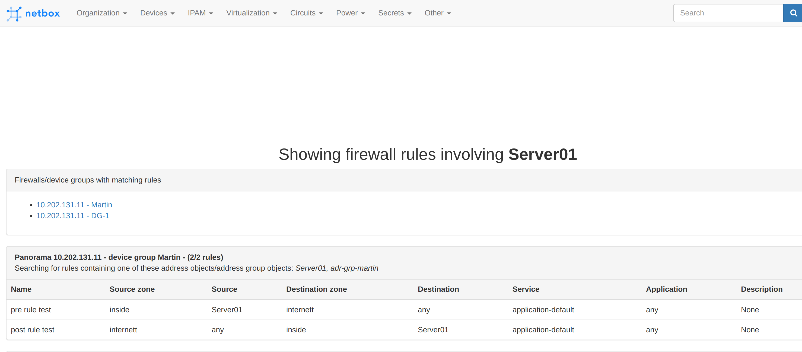

# Palo Alto Networks firewall/Panorama NetBox plugin

This plugin enables you to list firewall rules defined on your Palo Alto Networks firewall or Panorama management server directly in NetBox. The URL `<NETBOX>/plugins/paloalto/<object>` will list all firewall rules associated with object (see limitations further down).

## Preview


## Compatibility
NetBox 2.8 and higher.  
Tested on Panorama PAN-OS 9.1 and PA-220 PAN-OS 9.1.

## Installation
Add `netbox-paloalto` to your local_requirements.txt. 

Add `netbox_paloalto` to `configuration.py` like this:
```
PLUGINS = ['netbox_paloalto']
```
Run `./upgrade.sh` which will download the package and run the necessary database migrations.

Add you firewall/Panorama (can have multiple) through the Admin GUI of NetBox.

### Available settings
Assume a NetBox object with name Server01 and IP 1.2.3.4.  
Available settings in PLUGINS_CONFIG is:
```
transform: True/False - Netbox object is transformed before the search in Panorama/firewall. 
                        Additional search term will be Server01.3.4. Default: False
nesting: <int> - The number of levels of nesting within address groups to perform. Default: 1
```

## Generate your Palo Alto firewall API key
See [Palo Alto Networks documentation](https://docs.paloaltonetworks.com/pan-os/9-0/pan-os-panorama-api/get-started-with-the-pan-os-xml-api/get-your-api-key.html) on generating your API key.

## Limitations
* Limited nesting for address groups as default
* Does not include "any" rules based on zones (as we can't tell the zone from the object name)
* Does not match with subnet rules (you can have a rule saying 10.0.0.0/8 is allowed, but your object with the address 10.1.1.1 is not listed)
* Does currently not support other rule types than security rules (no NAT/Decryption/etc)
